# Architecture Overview

This document provides a comprehensive overview of the Keystone Security Platform architecture, including system components, data flow, and integration patterns.

## System Architecture Overview

Keystone is designed as a comprehensive DevSecOps automation platform that integrates vulnerability scanning, SBOM generation, and policy enforcement into GitHub workflows.

### High-Level Architecture

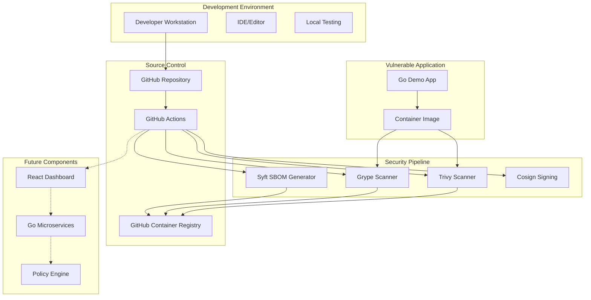

## Current Implementation Architecture

### Security Pipeline Workflow

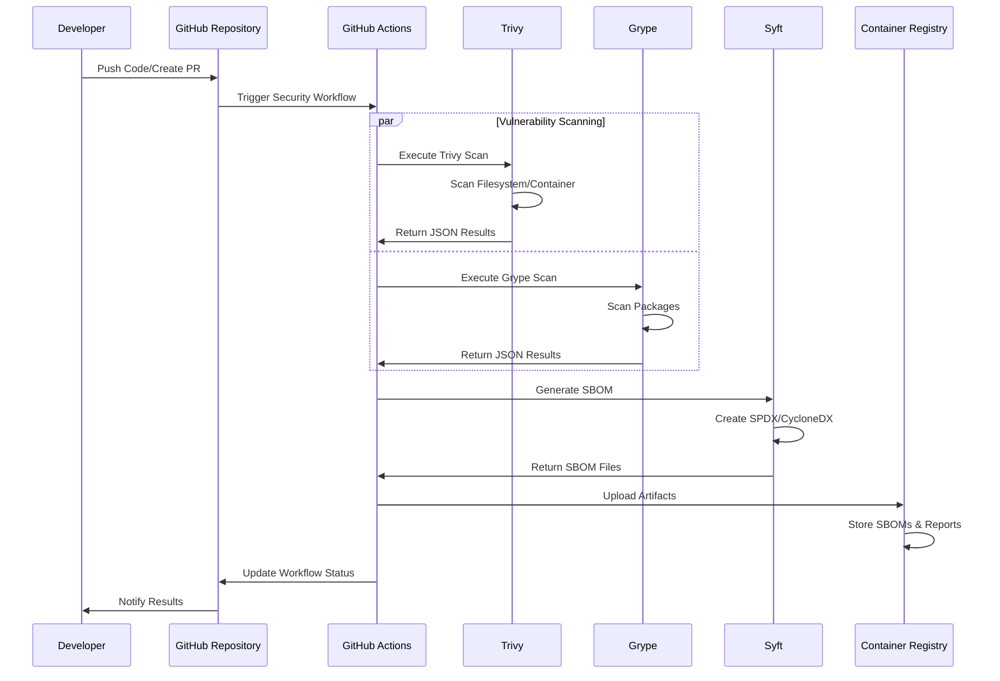

### Component Integration Architecture

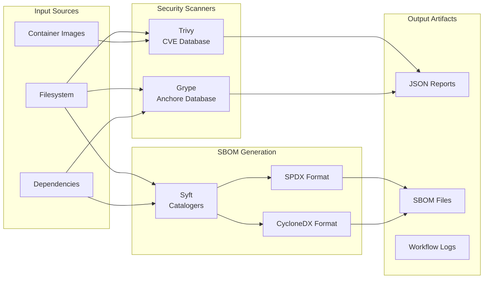

## Data Flow Architecture

### Vulnerability Detection Data Flow

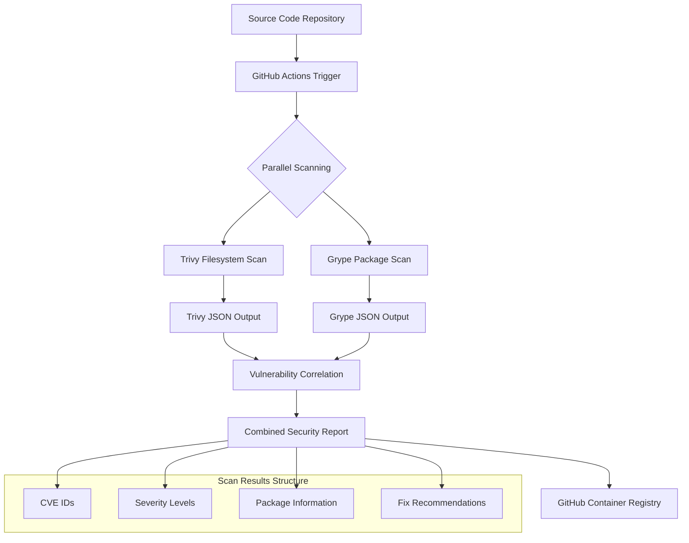

### SBOM Generation Data Flow

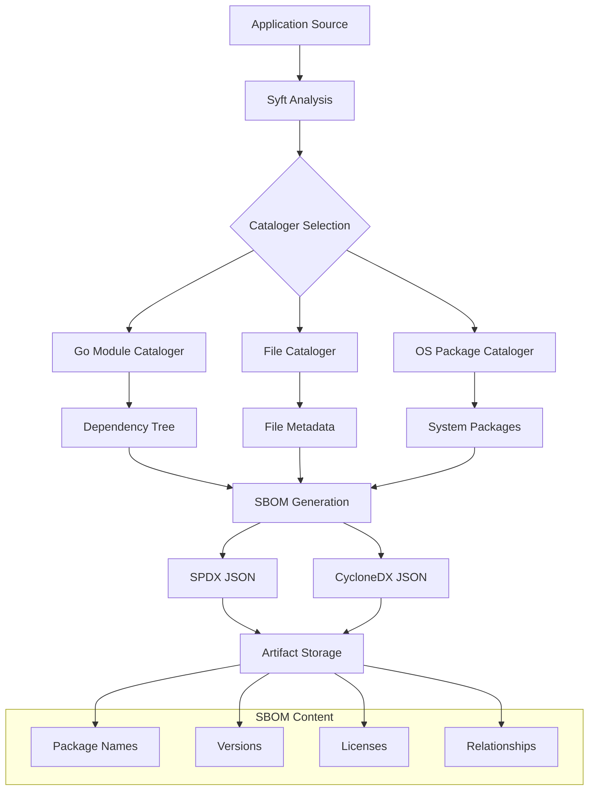

## Security Pipeline Implementation

### GitHub Actions Workflow Architecture

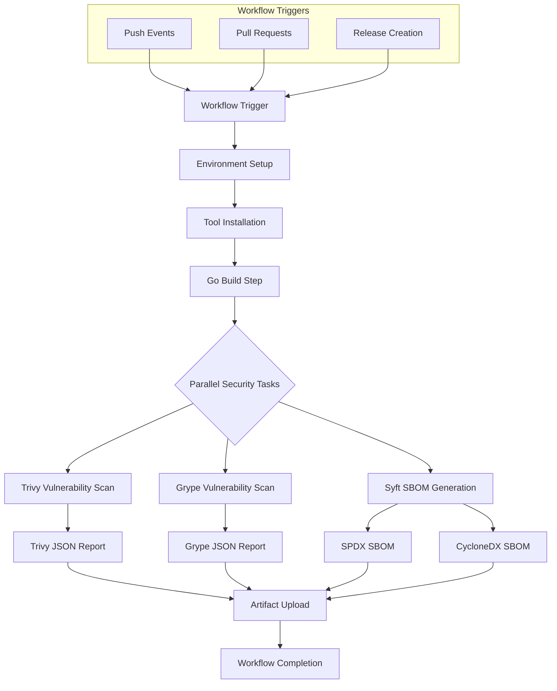

### Local Development Architecture

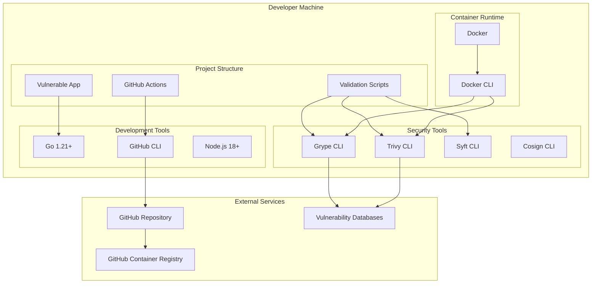

## Technology Stack Architecture

### Current Implementation Stack

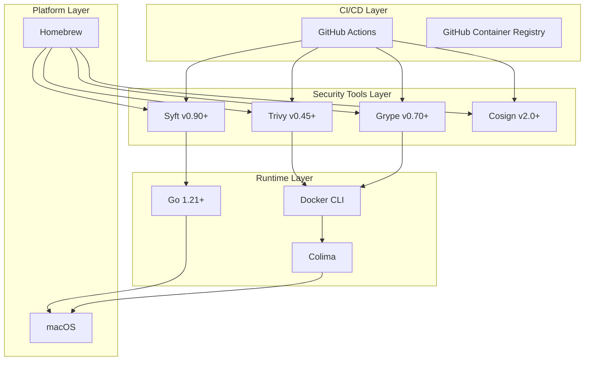

### Planned Future Architecture

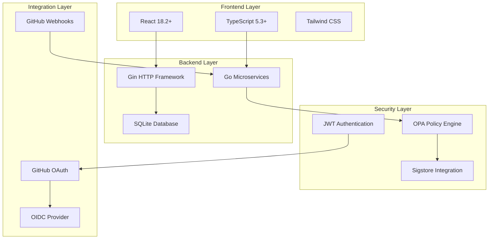

## Deployment Architecture

### GitHub Actions Deployment

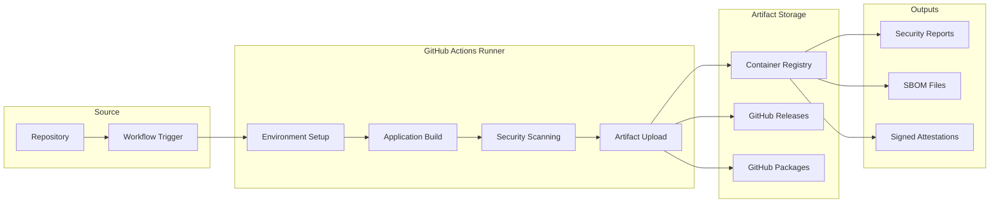

### Local Development Deployment

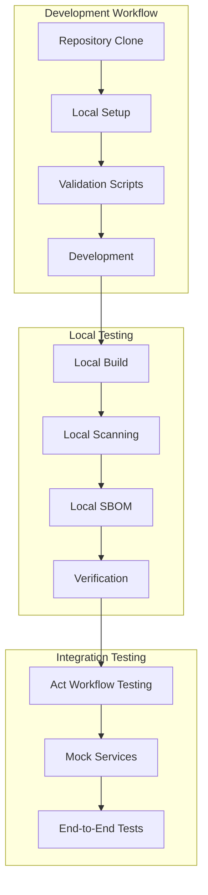

## Security Architecture

### Threat Model Architecture

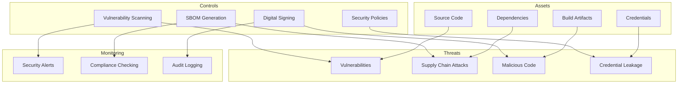

### Security Pipeline Architecture

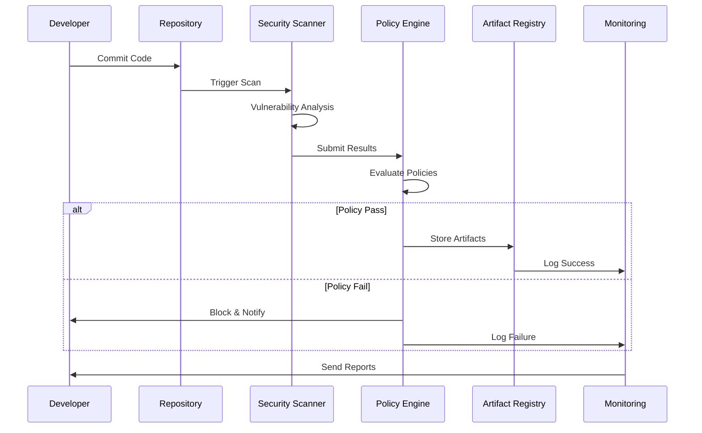

## API Architecture (Planned)

### RESTful API Design

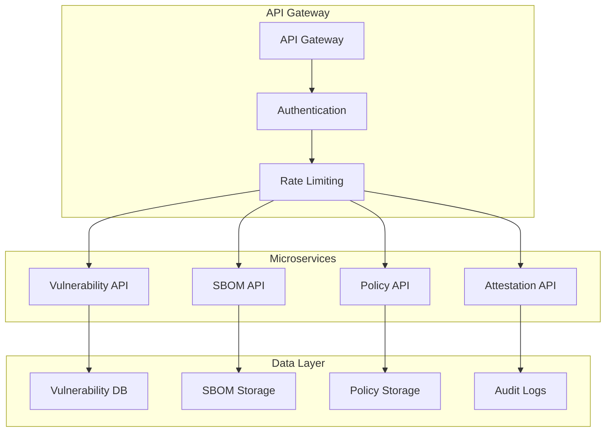

## Data Architecture

### Data Storage Strategy

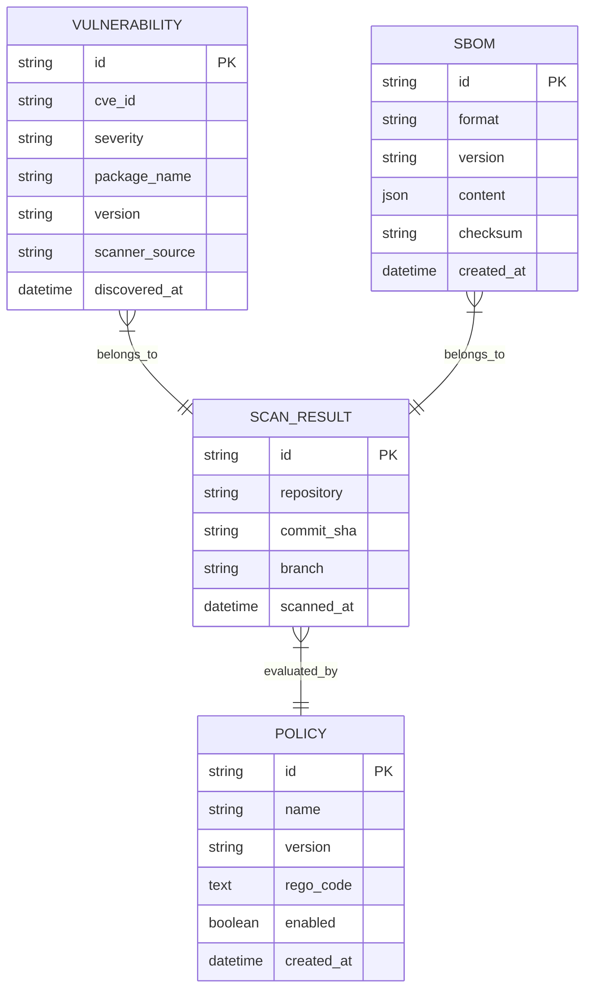

## Performance Architecture

### Scalability Considerations

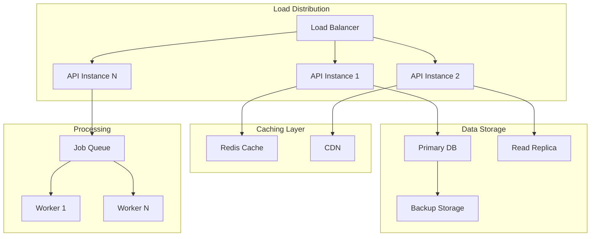

## Monitoring and Observability

### Observability Architecture

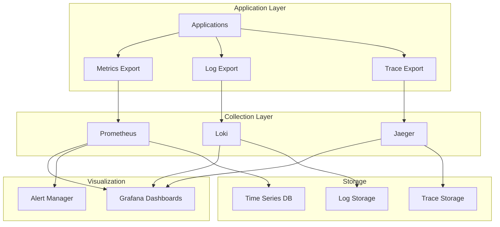

## Future Architecture Roadmap

### Phase 1: Foundation (Completed)
- Multi-scanner vulnerability detection
- SBOM generation and storage
- GitHub Actions integration
- Vulnerable demo application

### Phase 2: Intelligence (Planned)
- Vulnerability correlation and deduplication
- Policy engine integration
- Automated remediation suggestions
- Security metrics and reporting

### Phase 3: Platform (Future)
- Real-time security dashboard
- API ecosystem for integrations
- Multi-repository support
- Enterprise authentication

### Phase 4: Scale (Future)
- Distributed scanning architecture
- Advanced policy as code
- Supply chain security attestation
- AI-powered vulnerability analysis

## Architecture Decision Records

### ADR-001: Scanner Selection
**Decision**: Use Trivy and Grype for vulnerability scanning
**Rationale**: Complementary coverage, active maintenance, strong community support

### ADR-002: SBOM Format Support
**Decision**: Support both SPDX and CycloneDX formats
**Rationale**: Industry standard compliance, broad tool compatibility

### ADR-003: Container Runtime
**Decision**: Use Colima for macOS development
**Rationale**: Avoid Docker Desktop licensing, maintain container compatibility

### ADR-004: GitHub Actions Integration
**Decision**: Native GitHub Actions for CI/CD pipeline
**Rationale**: Zero configuration for GitHub repositories, integrated artifact storage

This architecture documentation provides a comprehensive view of Keystone's current implementation and future roadmap, enabling technical evaluation and system understanding for developers and stakeholders.